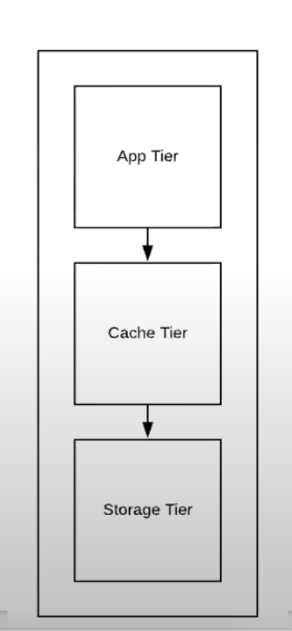

# Step 1:
## a. Collect functional requirement 
- Use registration + login + profile
- Search
- Recommendation
- Payment
- Content ingestion and delivery
    - Rights and license
    - Categorizations
- Notifications
- Trending movies
- Watch history

## b. Collect design constraints
- Number of users: 100 millions
- Number of content ingested/sec: 
- Volume of content delivered/sec:
- Content size:
- Rate of user activity tracking:

# Step 2:
## a. Bucketize functional requirements into micro services
Building blocks for each functional group
- Use registration + login + profile
- Search
- Recommendation
    - User activity service
    - Recommendation generator
        - Take snapshot of data from expresso
        - Put data into HDFS
        - Run Map Reducer
    - Recommendation dashboard
- Payment
- Content ingestion and delivery
    - Rights and license
    - Categorizations
- Notifications
- Trending movies
- Watch history
## b. Get clarity weather problem is breadth-oriented or depth-oriented
breadth-oriented

# Step 3:
## a. Draw a logical diagram
- API gateway 

## b. Draw and explain data/logic flow between them

# Step 4:
## a. Deep dive on each micro services at a time
- Use registration + login + profile - NO
- Search - NO
- Recommendation - No
    - User activity service
    - Recommendation generator
        - Take snapshot of data from expresso
        - Put data into HDFS
        - Run Map Reducer
    - Recommendation dashboard
- Payment - No
- Content ingestion and delivery - Yes
    - Rights and license
    - Categorizations
- Notifications - No
- Trending movies - No
- Watch history - Yes
### Content Ingestion and delivery service

- App tier
- Cache for content metadata
- Storage for both data and metadata

Data structure 
- Metadata
- K: content id, v: json object for metadata
- Data
- k: content id v: byte stream
How to store metdata?
- Hashmap in memory
-  Row oriented in storage
How to store data?
- File system
API?
- create(K,V) for ingestion
- read(K, offset)

## b. Content micro service
- Do we need to scale for metadata? No
    - A*B A=number of K-Vs B= size of K-V
    - Metadata: 20,000 * 10KB = 200MB storage is trivial 
- Need to scale for data? Yes
    - Data: 20,000 * 10GB = 200TB
- Need to scale for throughput? Yes
    - For one user 3MB per seconds
    - Number of create(K,V) = negligible
    - Total 100 million users
    - Let's say 10% are watching at the same time.
    - read(K, offset) : 3MB/s * 10 millions users = 30 TB/sec
        - A single server delivers around 1-2GB/s (SSD) and 300MB/s for spinning disk
        - So need to scale
        - Solve by CDN
        - Add 30 CDN
        - This will give 1TB/sec per CDN
        - Allow GEO distribution data
        - 30TB divided into geo distribution
        - Within CDN needs to scale
        - Instead of storage server, we need file system server
        - How to shard? Horizontally vs Vertically?
        - Horizontally >> If movie is too hot then everyone will go to same shard
        - Size of movie is too large, we can cut it vertically
        - Will keep it hybrid    
        - Some movie with some offset
        - First 120MB of a particual movier on one shard
        - Consumer, has to give an API to router, to gives both movie and offset
        - read(K, offset)
        - Chrome device/heroku is simply a ring buffer
            - It acts as producer consumer
        - Browser based app will have player to support buffering feature
            - Model the producer consumer
            - read(K, offset)   
        - Player logic
            - consumption rate should be lower than the production rate
            - otherwise you will see the circle
            - seed for a frame consumption rate and delivery rate
            - Delivery rate should be higher
            - Keep downloading data at 3MB/sec
            - Showing data at much lesser rate
            - Queue is always full
            - Moment if you are not able to deliver at the desired rate then you will see bufferring
        - Why need hybrid?
            - We were able to reduce the hotspot
            - We were able to distribute the read workload (bcz throughput was bottleneck)
            - dividing by chunks helps
            - Google has GFS
            - Hadoop is open source of GFS
            - GFS stores chunks of 64MB
            - It allow randomly distributes contents across servers
            - Read API have to  gives chunk id so that content can be read
            - If movie is so hot then?
            - Replication will help                    
    - Metadata read is negligible
    
